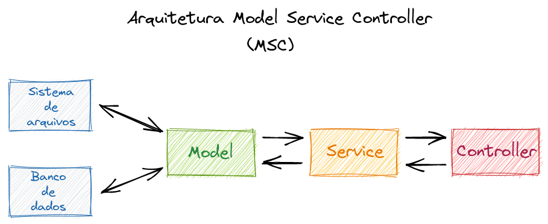
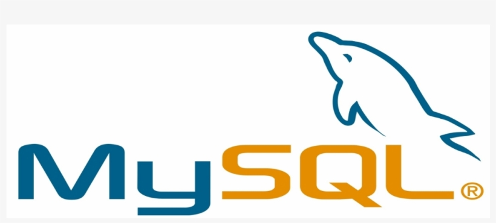
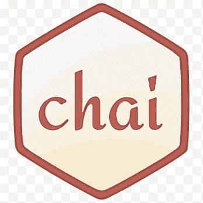

<!-- WIP -->

<h1 align="center">Projeto NodeJs - Store Manager</h1>

<p align="center"> 
  
</p>

<p align="center">
  
</p>

<!-- TABLE OF CONTENTS -->
<h2 id="table-of-contents"> :book: Tabela de Conteúdos</h2>

<details open="open">
  <summary>Tabela de conteúdos</summary>
  <ol>
    <li><a href="#sobre"> ➤ Sobre o projeto</a></li>
    <li><a href="#tecnologias"> ➤ Tecnologias utilizadas</a></li>
    <li><a href="#descrição-do-projeto"> ➤ Descrição do projeto</a></li>
    <li><a href="#instruções"> ➤ Instruções</a></li>
    <li><a href="#requisitos"> ➤ Requisitos realizados </a></li>
    <li><a href="#requisito1"> ➤ Requisito 1: Criação de endpoints para listar produtos </a></li>
    <li><a href="#requisito2"> ➤ Requisito 2: Desenvolvimento de testes para cobertura de 5% </a></li>
    <li><a href="#requisito3"> ➤ Requisito 3: Criação de endpoint para cadastrar produtos </a></li>
    <li><a href="#requisito4"> ➤ Requisito 4: Criação de validações para produtos </a></li>
    <li><a href="#requisito5"> ➤ Requisito 5: Desenvolvimento de testes para cobertura de 10% </a></li>
    <li><a href="#requisito6"> ➤ Requisito 6: Criação de endpoint para validar e cadastrar vendas </a></li>
    <li><a href="#requisito7"> ➤ Requisito 7: Desenvolvimento de testes para cobertura de 15% </a></li>
    <li><a href="#requisito8"> ➤ Requisito 8: Criação de endpoints para listar vendas </a></li>
    <li><a href="#requisito9"> ➤ Requisito 9: Desenvolvimento de testes para cobertura de 20% </a></li>
    <li><a href="#requisito10"> ➤ Requisito 10: Criação de endpoint para atualizar um produto </a></li>
    <li><a href="#requisito11"> ➤ Requisito 11: Desenvolvimento de testes para cobertura de 25% </a></li>
    <li><a href="#requisito12"> ➤ Requisito 12: Criação de endpoint para deletar um produto </a></li>
    <li><a href="#requisito13"> ➤ Requisito 13: Desenvolvimento de testes para cobertura de 30% </a></li>
    <li><a href="#requisito14"> ➤ Requisito 14: Criação de endpoint para deletar uma venda </a></li>
    <li><a href="#requisito15"> ➤ Requisito 15: Desenvolvimento de testes para cobertura de 35% </a></li>
    <li><a href="#requisito16"> ➤ Requisito 16: Criação de endpoint para atualizar uma venda </a></li>
    <li><a href="#requisito17"> ➤ Requisito 17: Desenvolvimento de testes para cobertura de 40% </a></li>
    <li><a href="#requisito18"> ➤ Requisito 18: Criação de endpoint para busca de produtos por termo </a></li>
    <li><a href="#requisito19"> ➤ Requisito 19: Desenvolvimento de testes para cobertura de 50% </a></li>
    <li><a href="#requisito20"> ➤ Requisito 20: Desenvolvimento de testes para cobertura de 60% </a></li>
    <li><a href="#créditos"> ➤ Créditos </a></li>
  </ol>
</details>

<p align="center">
  
</p>

<h2 id="sobre"> :pencil: Sobre o projeto </h2>

  <p align="center">
  Projeto desenvolvido durante a formação de BackEnd na Trybe com o intuito de consolidar o aprendizado de NodeJs, utilizando o padrão de arquitetura MSC e o padrão arquitetural de APIs REST, bem como o framework de testes Mocha junto às libraries Chai e Sinon.<br /><br />
  
  </p>

<p align="center">
  
</p>

<h2 id="tecnologias"> :computer: Tecnologias utilizadas</h2>

<p align="center">
  <a href="https://www.docker.com/" target="_blank"></a>
  <a href="https://code.visualstudio.com/" target="_blank"></a>
  <a href="https://github.com/" target="_blank"></a>
  <a href="https://www.mysql.com/" target="_blank"></a>
  <br />
  <a href="https://nodejs.org/en/" target="_blank"></a>
  <a href="https://nodemon.io/" target="_blank"></a>
  <a href="https://mochajs.org/" target="_blank"></a>
  <a href="https://www.chaijs.com/" target="_blank"></a>
  <a href="https://sinonjs.org/" target="_blank"></a>
  <br />
  <a href="https://expressjs.com/" target="_blank"></a>
  <a href="https://joi.dev/" target="_blank"></a>
  <a href="https://www.restapitutorial.com/" target="_blank"></a>
</p>

<p align="center">
  
</p>

<h2 id="descrição-do-projeto"> :page_facing_up: Descrição</h2>

<details>
  <summary>Descrição</summary><br />
  Foi construída uma API para funcionar como um sistema de gerenciamento de vendas no formato dropshipping, no qual é possível criar, visualizar, deletar e atualizar produtos e vendas.
  Tem-se os arquivos (`migration.sql` e `seed.sql`) que foram utilizados para criação e população do banco de dados.<br /><br />
  
  Neste projeto eu realizei:
  
  <ol>
    <li>Utilização do banco de dados MySQL para gestão de dados</li>
    <li>Construção de um CRUD onde o usuário não depende de cadastro para interagir</li>
    <li>Validação de dados enviados nas requisições para alterar ou cadastrar vendas e produtos</li>
    <li>
      Utilização do padrão REST para garantir que: os endpoints sempre retornem respostas com códigos de status corretos, os verbos http são adequados para cada operação e, as URLs estão agrupadas e padronizadas em cada recurso
    </li>
    <li>
      Utilização da arquitetura MSC para garantir que: o banco de dados seja acessado somente pelo Model, que o Service seja responsável pelas regras de negócio e, que o Controller seja responsável por receber as requisições e enviar as respostas
    </li>
  </ol><br />

  Durante o desenvolvimento foi utilizado Docker para evitar a restauração manual do banco de dados.<br />  
</details>

<p align="center">
  
</p>

<h2 id="instruções"> :scroll: Instruções</h2>

1. Clone o repositório
  * `git clone git@github.com:Gabrielle-Murat/NodeJs-StoreManager.git`
  * Entre na pasta do repositório que você acabou de clonar;
<br />

2. Instale as dependências:
  * `npm install`
<br />

3. Como restaurar o banco de dados, se necessário:
  * Abra o MySQL Workbench,
  * Abra uma nova aba de query e cole dentro dela todo o conteúdo dos arquivos: `migration.sql` e, logo abaixo, `seed.sql`,
  * Execute a query e aguarde alguns segundos,
  * Atualize a lista de dbs;
<br />
  
4. Utilizando Docker:
  * Rode os serviços `node` e `db` com o comando `docker-compose up -d` (adapte a porta padrão, se necessário),
  * Com isso, serão inicializados dois containers: `store_manager` e `store_manager_db`
  * Use o comando `docker exec -it store_manager bash` (para acessar o terminal interativo do container `store_manager`),
  * As credenciais de acesso ao db estão definidas no arquivo `docker-compose.yml`, sendo acessíveis no container através das variáveis de ambiente          `MYSQL_USER` e `MYSQL_PASSWORD`
  * Instale as dependências com `npm install`
  * Todos os comandos disponíveis no `package.json` agora podem ser executados no terminal do container
<br />

5. Configurando as variáveis de ambiente:
  * Cria um arquivo .env na raiz do projeto com as variáveis de ambiente
  * O arquivo terá o seguinte formato:
    ```sh
      MYSQL_HOST=localhost
      MYSQL_USER=nome
      MYSQL_PASSWORD=senha
      MYSQL_DATABASE=StoreManager
      PORT=portaParaConexãoComOServidor
    ```
  * As variáveis de ambiente já estão configuradas no arquivo `connection.js` na pasta models;
<br />

6. Para iniciar o servidor em modo de desenvolvimento:
  * Execute o comando: `npm run debug`
<br />
    
<p align="center">
  
</p>

<h2 id="requisitos"> :woman_technologist: Requisitos Realizados:</h2>

<details open="open">
  <summary>Criação de API:</summary>

  <h4 id="requisito1">Requisito 1: Criação de endpoints para listar produtos </h4>
  
    1. Criar dois endpoints para listar: todos os produtos e, o produto baseado no id da rota:
      1.1. Listar todos os produtos através do caminho `/products`.
      1.2. Listar apenas o produto com o `id` presente na rota através do caminho `/products/:id`.
      1.3. Listar o resultado de forma crescente pelo campo `id`.

  <h4 id="requisito2">Requisito 2: Desenvolvimento de testes para cobertura de 5% </h4>
  
    2. Desenvolver testes para cobrir 5% de cada camada da aplicação:
      2.1. Os testes da camada model devem mockar o db.

  <h4 id="requisito3">Requisito 3: Criação de endpoint para cadastrar produtos </h4>
  
    3. Criar um endpoint para cadastrar produtos:
      3.1. Cadastrar produtos através do caminho `/products`.
      3.2. Os produtos devem ser salvos na tabela correta do db.
      3.3. O corpo da requisição deve conter o campo `name`

  <h4 id="requisito4">Requisito 4: Criação de validações para produtos </h4>
  
    4. Validar o campo `name` recebido no corpo da requisição:
      4.1. As validações devem retornar os status corretos e suas respectivas mensagens de erros.
      4.2. Não deve ser possível realizar operações em um produto sem o campo `name`.
      4.3. O campo `name` deve possuir ao menos 5 caracteres.

  <h4 id="requisito5">Requisito 5: Desenvolvimento de testes para cobertura de 10% </h4>
  
    5. Desenvolver testes para cobrir 10% de cada camada da aplicação:
      5.1. Os testes da camada model devem mockar o db.

  <h4 id="requisito6">Requisito 6: Criação de endpoint para validar e cadastrar vendas </h4>
  
    6. Criar um endpoint para cadastrar vendas:
      6.1. Cadastrar vendas através do caminho `/sales`.
      6.2. As vendas enviadas devem ser salvas nas tabelas: `sales` e `sales_products` do db.
      6.3. Deve ser possível cadastrar a venda de vários produtos na mesma requisição.
      6.4. O corpo da requisição deve conter um array de objetos, onde cada objeto representa um produto.
      6.5. Cada objeto possui as seguintes chaves: `productId` e `quantity`.
      6.6. Não deve ser possível realizar operações em uma venda sem os campos `productId` e `quantity`.
      6.7. O campo `quantity` deve ser maior que zero.
      6.8. Não deve ser possível realizar operações em uma venda se o campo `id` não existir no db.

  <h4 id="requisito7">Requisito 7: Desenvolvimento de testes para cobertura de 15% </h4>
  
    7. Desenvolver testes para cobrir 15% de cada camada da aplicação:
      7.1. Os testes da camada model devem mockar o db.

  <h4 id="requisito8">Requisito 8: Criação de endpoints para listar vendas </h4>
  
    8. Criar dois endpoints para listar: todos os produtos e, o produto baseado no id da rota:
      8.1. Listar todos as vendas através do caminho `/sales`.
      8.2. Listar apenas a venda com o `id` presente na rota através do caminho `/sales/:id`.
      8.3. Listar o resultado de forma crescente pelo campo `saleId`.
      8.4. Em caso de empate: listar de forma crescente pelo campo `productId`.

  <h4 id="requisito9">Requisito 9: Desenvolvimento de testes para cobertura de 20% </h4>
  
    9. Desenvolver testes para cobrir 20% de cada camada da aplicação:
      9.1. Os testes da camada model devem mockar o db.

  <h4 id="requisito10">Requisito 10: Criação de endpoint para atualizar um produto </h4>
  
    10. Criar um endpoint para atualizar um produto baseado no id da rota:
      10.1. Atualizar produtos através do caminho `/products/:id`.
      10.2. O corpo da requisição deve conter o campo `name`.
      10.3. Validar o corpo da requisição assim como no cadastro.
      10.4. Não deve ser possível alterar um produto que não existe no db.

  <h4 id="requisito11">Requisito 11: Desenvolvimento de testes para cobertura de 25% </h4>
  
    11. Desenvolver testes para cobrir 25% de cada camada da aplicação:
      11.1. Os testes da camada model devem mockar o db.
  
  <h4 id="requisito12">Requisito 12: Criação de endpoint para deletar um produto </h4>
  
    12. Criar um endpoint para deletar um produto baseado no id da rota:
      12.1. Deletar produtos através do caminho `/products/:id`.
      12.2. Não deve ser possível deletar um produto inexistente no db.
  
  <h4 id="requisito13">Requisito 13: Desenvolvimento de testes para cobertura de 30% </h4>
  
    13. Desenvolver testes para cobrir 30% de cada camada da aplicação:
      13.1. Os testes da camada model devem mockar o db.
  
  <h4 id="requisito14">Requisito 14: Criação de endpoint para deletar uma venda </h4>
  
    14. Criar um endpoint para deletar uma venda baseado no id da rota:
      12.1. Deletar vendas através do caminho `/sales/:id`.
      12.2. Não deve ser possível deletar uma venda inexistente no db.
  
  <h4 id="requisito15">Requisito 15: Desenvolvimento de testes para cobertura de 35% </h4>
  
    15. Desenvolver testes para cobrir 35% de cada camada da aplicação:
      15.1. Os testes da camada model devem mockar o db.

  <h4 id="requisito16">Requisito 16: Criação de endpoint para atualizar uma venda </h4>
  
    16. Criar um endpoint para atualizar uma venda baseado no id da rota:
      10.1. Atualizar vendas através do caminho `/sales/:id`.
      10.2. O corpo da requisição deve conter um array de objetos, onde cada objeto representa um produto.
      10.3. Cada objeto possui as seguintes chaves: `productId` e `quantity`.
      10.4. O corpo da requisição deve ser validado assim como no cadastro.
      10.5. Não deve ser possível alterar uma venda que não existe no db.

  <h4 id="requisito17">Requisito 17: Desenvolvimento de testes para cobertura de 40% </h4>
  
    17. Desenvolver testes para cobrir 40% de cada camada da aplicação:
      17.1. Os testes da camada model devem mockar o db.
  
  <h4 id="requisito18">Requisito 18: Criação de endpoint para busca de produtos por termo </h4>
  
    18. Criar um endpoint para buscar produtos baseados no queryTerm, se existirem.
      18.1. Procurar produtos através do caminho `/products/search`.
      18.2. Deve ser retornado um array de produtos que contenham em seu nome o termo passado na URL.
      18.3. Caso nenhum produto seja encontrado, deve ser retornado um array vazio.
      18.4. Se nenhum termo for passado, deve ser retornado um array contendo todos os produtos.
  
  <h4 id="requisito19">Requisito 19: Desenvolvimento de testes para cobertura de 50% </h4>
  
    19. Desenvolver testes para cobrir 50% de cada camada da aplicação:
      19.1. Os testes da camada model devem mockar o db.
  
  <h4 id="requisito20">Requisito 20: Desenvolvimento de testes para cobertura de 60% </h4>
  
    20. Desenvolver testes para cobrir 60% de cada camada da aplicação:
      20.1. Os testes da camada model devem mockar o db.

</details>
<br />


<p align="center">
  
</p>

<h2 id="créditos"> 💳 Créditos</h2>

<p align="center">Arquivo de seed (seed.sql), migration (migration.sql), docker (Dockerfile) e docker compose (docker-compose.yml) fornecidos pela Trybe.</p>
<p align="center"><a href="https://www.betrybe.com/" target="_blank"></a></p>
